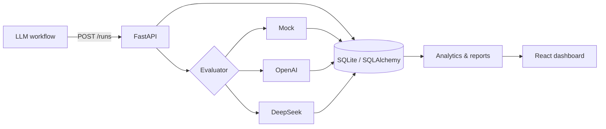

# Agent Lens

[English](README.md) · [简体中文](README.zh-CN.md)

> Early alpha. A small, self-hosted dashboard for evaluating report-generating LLM workflows.

[](https://github.com/BrownieCoder/agent-lens/actions/workflows/ci.yml)
[](LICENSE)
[](https://github.com/BrownieCoder/agent-lens/releases/tag/v0.1.0-alpha)

I built Agent Lens to answer a recurring question in my own workflow: after changing a prompt or model, did the report actually improve? The app records runs, scores them against a fixed rubric, and compares quality alongside cost, latency, and failures.


## Background

The first version grew out of an `x-signal-agent` experiment that turns market signals into short research notes. Looking at traces was useful for debugging, but it did not help me decide whether one prompt produced better research than another. I wanted a local tool with a deliberately narrow loop:

```text
output → evaluation → comparison → prompt change
```

The sample data still reflects that original financial-research use case. The storage and API layers do not depend on it, so other report-style workflows can use the same run and evaluation model.

## What works today

- Store workflow inputs, outputs, model metadata, token usage, cost, latency, and errors.
- Score reports across seven dimensions and flag six common review risks.
- Run evaluations offline with the deterministic mock evaluator, or use OpenAI and DeepSeek.
- Compare prompt versions and keep difficult inputs as regression cases.
- Export a Markdown evaluation summary for experiment notes.

## Demo

`make seed` creates 24 runs against 12 paired cases. The `v1` outputs are intentionally vague; `v2` adds evidence, risks, and a next action. This makes the comparison screens useful immediately, without spending API credits.

## Quick start

Requirements: Python 3.11+, Node.js 20+, and `make`.

```bash
git clone https://github.com/BrownieCoder/agent-lens.git
cd agent-lens
make setup
cp .env.example backend/.env
make seed
make dev
```

Open:

- Dashboard: `http://localhost:5173`
- API docs: `http://localhost:8000/docs`
- Health check: `http://localhost:8000/health`

`make dev` runs the backend and frontend together. You can also run `make backend` and `make frontend` in separate terminals.

## Evaluators

The default is `mock`, so a fresh clone works without credentials.

| Backend | Key required | Output contract | Intended use |
|---|---|---|---|
| `mock` | No | Deterministic Pydantic payload | Local demo, tests, offline development |
| `openai` | `OPENAI_API_KEY` | Strict JSON Schema | Hosted evaluator |
| `deepseek` | `DEEPSEEK_API_KEY` | JSON mode + Pydantic validation | Hosted evaluator |

Configure the default in `backend/.env`:

```dotenv
EVALUATOR_BACKEND=deepseek
DEEPSEEK_API_KEY=your_key
DEEPSEEK_EVALUATOR_MODEL=deepseek-v4-flash
```

Or override it for one request:

```bash
curl -X POST http://localhost:8000/runs/1/evaluate \
  -H 'Content-Type: application/json' \
  -d '{"evaluator_type":"deepseek"}'
```

Provider calls incur provider charges. Model-produced JSON is always validated before persistence; malformed or empty provider output returns HTTP `502` instead of being stored.

## Architecture



```text
backend/app/
  models/       Run, evaluation, and regression entities
  routers/      Run, evaluation, dashboard, regression, and report APIs
  services/     Evaluators, analytics, and Markdown export
  schemas/      Validated request and response contracts
frontend/src/
  pages/        Dashboard, runs, prompt comparison, regression cases
  components/   Score cards, charts, tables, evaluation breakdown
```

## API overview

| Method | Endpoint | Purpose |
|---|---|---|
| POST | `/runs` | Log a workflow run |
| GET | `/runs` | Filter and list runs |
| GET | `/runs/{id}` | Inspect a run and its evaluations |
| POST | `/runs/{id}/evaluate` | Run Mock, OpenAI, or DeepSeek evaluation |
| GET | `/runs/{id}/evaluation` | Fetch the latest evaluation |
| GET | `/dashboard/summary` | Aggregate KPI summary |
| GET | `/dashboard/trends` | Daily quality, cost, and latency trends |
| GET | `/dashboard/prompt-comparison` | Compare prompt versions |
| GET | `/dashboard/ranked-runs` | Find best and worst runs |
| POST/GET | `/regression-cases` | Create or list regression cases |
| GET | `/regression-cases/{id}/runs` | Compare runs linked to one case |
| POST | `/reports/evaluation-summary` | Export a Markdown summary |

## Verification

```bash
make check
```

This runs backend tests, Python compilation, the frontend build, and the npm audit. CI runs the same checks on pushes and pull requests.

## Current boundaries

This alpha release is designed for local development and trusted networks. It does not yet include authentication, authorization, multi-tenancy, redaction, rate limiting, or schema migrations. Do not expose the development servers publicly or ingest confidential data without adding the controls required by your environment. See [SECURITY.md](SECURITY.md).

LLM-as-judge output is a signal, not ground truth. Calibrate scoring against human review before using it for high-stakes decisions.

## Roadmap

- Human review and evaluator calibration
- Pairwise output comparison
- Dataset and experiment versioning
- Alembic migrations and Postgres production profile
- OpenTelemetry trace ingestion
- CI quality gates for Prompt regressions

See [PLAN.md](PLAN.md) for implementation notes and open questions.

## Project notes

- Contributions: [CONTRIBUTING.md](CONTRIBUTING.md)
- Changelog: [CHANGELOG.md](CHANGELOG.md)
- Release checklist: [docs/RELEASE_CHECKLIST.md](docs/RELEASE_CHECKLIST.md)
- License: [MIT](LICENSE)
