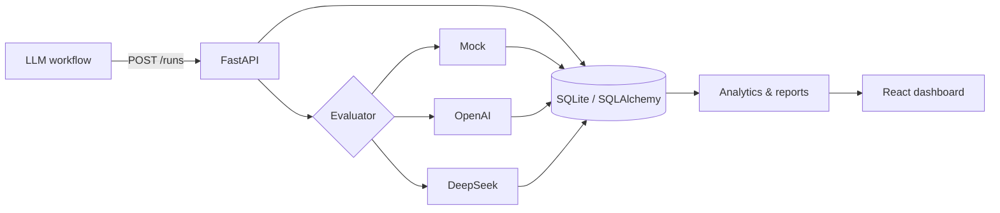

# Agent Lens

> **Alpha** — a lightweight, self-hosted evaluation dashboard for report-generating LLM workflows.

[](https://github.com/BrownieCoder/agent-lens/actions/workflows/ci.yml)
[](LICENSE)
[](https://github.com/BrownieCoder/agent-lens/releases/tag/v0.1.0-alpha)

Agent Lens answers a practical question: **did a Prompt or model change make the output better, or merely different?** It logs workflow runs, evaluates outputs with a consistent rubric, compares Prompt versions, tracks cost and latency, and preserves hard cases as a regression dataset.


## Why this project exists

General-purpose observability platforms are powerful, but many teams first need a smaller quality loop they can understand and own:

```text
LLM output → structured evaluation → comparison → decision → Prompt improvement
```

The initial workflow is an `x-signal-agent`-style financial research report. The data model and APIs are intentionally generic enough for document summarization, legal workflows, and internal AI tools.

## Highlights

- **Eval-first workflow:** seven quality dimensions and six conservative risk flags.
- **Provider choice:** deterministic offline Mock evaluator, strict-schema OpenAI evaluator, and JSON-mode DeepSeek evaluator.
- **Evidence over vibes:** Prompt comparisons combine quality, cost, latency, volume, and failure rate.
- **Regression-ready:** 12 seeded hard cases and paired `v1`/`v2` runs make improvement visible immediately.
- **Small, readable stack:** FastAPI, SQLAlchemy, SQLite, React, TypeScript, and Recharts.
- **Portfolio-grade engineering:** automated tests, CI, dependency audit, security boundaries, changelog, and release checklist.

## Demo

The seed dataset intentionally makes `v2` more specific and risk-aware than `v1`. After startup, the dashboard shows the resulting score difference without requiring an external API key.

## Quick start

Requirements: Python 3.11+, Node.js 20+, and `make`.

```bash
git clone https://github.com/BrownieCoder/agent-lens.git
cd agent-lens
make setup
cp .env.example backend/.env
make seed
make dev
```

Open:

- Dashboard: `http://localhost:5173`
- API docs: `http://localhost:8000/docs`
- Health check: `http://localhost:8000/health`

`make dev` runs the backend and frontend together. You can also run `make backend` and `make frontend` in separate terminals.

## Evaluators

The default is `mock`, so a fresh clone works without credentials.

| Backend | Key required | Output contract | Intended use |
|---|---|---|---|
| `mock` | No | Deterministic Pydantic payload | Local demo, tests, offline development |
| `openai` | `OPENAI_API_KEY` | Strict JSON Schema | Production-style LLM-as-judge experiments |
| `deepseek` | `DEEPSEEK_API_KEY` | JSON mode + Pydantic validation | Lower-cost provider alternative |

Configure the default in `backend/.env`:

```dotenv
EVALUATOR_BACKEND=deepseek
DEEPSEEK_API_KEY=your_key
DEEPSEEK_EVALUATOR_MODEL=deepseek-v4-flash
```

Or override it for one request:

```bash
curl -X POST http://localhost:8000/runs/1/evaluate \
  -H 'Content-Type: application/json' \
  -d '{"evaluator_type":"deepseek"}'
```

Provider calls incur provider charges. Model-produced JSON is always validated before persistence; malformed or empty provider output returns HTTP `502` instead of being stored.

## Architecture



```text
backend/app/
  models/       Run, evaluation, and regression entities
  routers/      Run, evaluation, dashboard, regression, and report APIs
  services/     Evaluators, analytics, and Markdown export
  schemas/      Validated request and response contracts
frontend/src/
  pages/        Dashboard, runs, Prompt comparison, regression cases
  components/   Score cards, charts, tables, evaluation breakdown
```

## API overview

| Method | Endpoint | Purpose |
|---|---|---|
| POST | `/runs` | Log a workflow run |
| GET | `/runs` | Filter and list runs |
| GET | `/runs/{id}` | Inspect a run and its evaluations |
| POST | `/runs/{id}/evaluate` | Run Mock, OpenAI, or DeepSeek evaluation |
| GET | `/runs/{id}/evaluation` | Fetch the latest evaluation |
| GET | `/dashboard/summary` | Aggregate KPI summary |
| GET | `/dashboard/trends` | Daily quality, cost, and latency trends |
| GET | `/dashboard/prompt-comparison` | Compare Prompt versions |
| GET | `/dashboard/ranked-runs` | Find best and worst runs |
| POST/GET | `/regression-cases` | Create or list regression cases |
| GET | `/regression-cases/{id}/runs` | Compare runs linked to one case |
| POST | `/reports/evaluation-summary` | Export a Markdown summary |

## Verification

```bash
make check
```

This runs backend tests, Python compilation, the production frontend build, and the npm security audit. CI executes the same core checks on pushes and pull requests.

## Current boundaries

This alpha release is designed for local development and trusted networks. It does not yet include authentication, authorization, multi-tenancy, redaction, rate limiting, or schema migrations. Do not expose the development servers publicly or ingest confidential data without adding the controls required by your environment. See [SECURITY.md](SECURITY.md).

LLM-as-judge output is a signal, not ground truth. Calibrate scoring against human review before using it for high-stakes decisions.

## Roadmap

- Human review and evaluator calibration
- Pairwise output comparison
- Dataset and experiment versioning
- Alembic migrations and Postgres production profile
- OpenTelemetry trace ingestion
- CI quality gates for Prompt regressions

See [PLAN.md](PLAN.md) for implementation notes and optimization directions.

## Contributing and release status

- Contributions: [CONTRIBUTING.md](CONTRIBUTING.md)
- Changelog: [CHANGELOG.md](CHANGELOG.md)
- Release checklist: [docs/RELEASE_CHECKLIST.md](docs/RELEASE_CHECKLIST.md)
- License: [MIT](LICENSE)
