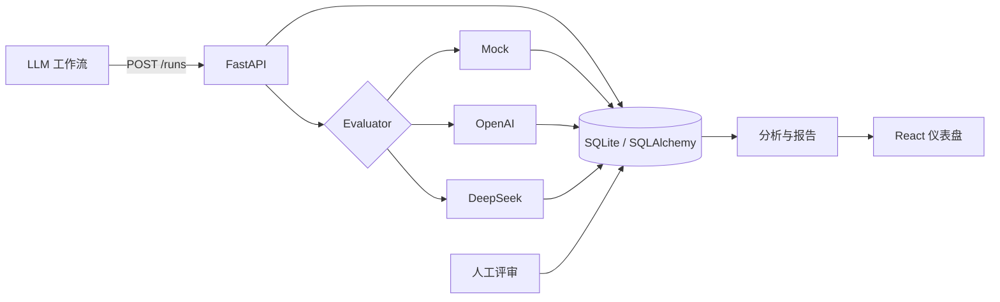

# Agent Lens

[English](README.md) · [简体中文](README.zh-CN.md)

> 早期 Alpha 版本。一个用于评估报告类 LLM 工作流的轻量、自托管仪表盘。

[](https://github.com/BrownieCoder/agent-lens/actions/workflows/ci.yml)
[](LICENSE)
[](https://github.com/BrownieCoder/agent-lens/releases/tag/v0.1.0-alpha)

我做 Agent Lens 是为了回答自己工作流里反复遇到的一个问题：修改 prompt 或模型之后，报告是真的变好了，还是只是变得不一样？它会记录每次运行，按照固定规则评分，并把质量、成本、延迟和失败情况放在一起比较。


## 项目背景

最初版本来自一个 `x-signal-agent` 实验：把市场信号整理成简短的研究笔记。链路追踪很适合排查错误，却很难回答哪一版 prompt 产出的研究结果更好。因此，我需要一个范围明确、可以本地运行的反馈循环：

```text
输出 → 评估 → 比较 → 修改 prompt
```

示例数据仍然保留了最初的金融研究场景，但存储层和 API 并不依赖这个场景，其他报告类工作流也可以复用同一套运行和评估模型。

## 当前功能

- 记录工作流输入、输出、模型信息、token 用量、成本、延迟和错误。
- 从七个维度评估报告，并标记六类常见审查风险。
- 使用确定性的 Mock evaluator 离线运行，或接入 OpenAI、DeepSeek。
- 比较不同 prompt 版本，并把困难输入保存为回归测试用例。
- 对具体 evaluator 结果进行盲评，并量化 judge 与人工评分的偏差。
- 导出 Markdown 格式的评估摘要，便于记录实验结论。

## 示例数据

`make seed` 会创建 24 次运行、12 组配对用例和 8 条合成人工评审。`v1` 输出被有意设计得较为模糊，`v2` 则加入证据、风险和下一步行动。因此，无需消耗 API 额度，启动后就能直接查看版本对比与校准效果。

## 快速开始

环境要求：Python 3.11+、Node.js 20+ 和 `make`。

```bash
git clone https://github.com/BrownieCoder/agent-lens.git
cd agent-lens
make setup
cp .env.example backend/.env
make seed
make dev
```

启动后可访问：

- 仪表盘：`http://localhost:5173`
- API 文档：`http://localhost:8000/docs`
- 健康检查：`http://localhost:8000/health`

`make dev` 会同时启动前后端，也可以分别运行 `make backend` 和 `make frontend`。

## Evaluator

默认使用 `mock`，首次克隆后不需要任何 API key。

| 后端 | 所需密钥 | 输出约束 | 用途 |
|---|---|---|---|
| `mock` | 无 | 确定性的 Pydantic 数据 | 本地演示、测试和离线开发 |
| `openai` | `OPENAI_API_KEY` | Strict JSON Schema | 托管 evaluator |
| `deepseek` | `DEEPSEEK_API_KEY` | JSON mode + Pydantic 校验 | 托管 evaluator |

在 `backend/.env` 中设置默认 evaluator：

```dotenv
EVALUATOR_BACKEND=deepseek
DEEPSEEK_API_KEY=your_key
DEEPSEEK_EVALUATOR_MODEL=deepseek-v4-flash
```

也可以在单次请求中覆盖默认设置：

```bash
curl -X POST http://localhost:8000/runs/1/evaluate \
  -H 'Content-Type: application/json' \
  -d '{"evaluator_type":"deepseek"}'
```

调用托管模型会产生相应费用。模型返回的 JSON 必须通过校验后才会写入数据库；无效或空响应会返回 HTTP `502`。

如需使用合成输入发起一次真实调用，同时避免启动应用或写入数据库：

```bash
make smoke-provider                   # DeepSeek
make smoke-provider PROVIDER=openai   # OpenAI
```

该命令从 `backend/.env` 读取对应的 key，只输出 provider、模型、评分、人工复核标记和 schema 状态。Provider 响应无效时会以非零状态退出。

## 人工评审与校准

人工判断应从专用的 **Blind review** 队列开始。该入口不会显示 evaluator 分数、flags、排名或模型优先级排序；普通 Runs 和分析页面并不是盲评入口。进入 Run 页面后，Agent Lens 会继续在首次人工评分保存前隐藏模型分数，减少锚定偏差。评审绑定具体的 `evaluation_id`，因此重新运行 evaluator 不会悄悄改变历史校准配对。完成盲评后，可以对比人工分与模型分，并选择接受、调整或拒绝模型判断。

Calibration 页面先对同一 evaluation 的多条人工评审取共识均值，再让该 evaluation 进入一次汇总，避免评审人数较多的样本获得额外权重。误差统一定义为 `模型分 − 人工分`，并展示：

- MAE 和 RMSE：误差幅度。
- Bias：正值表示 evaluator 系统性给分偏高。
- Agreement：绝对分差不超过 0.5。
- Large disagreement：绝对分差达到或超过 1.0。
- Pearson correlation：至少有两组非恒定配对时计算。
- 高风险样本：模型 overall 至少 4.0，但人工共识不高于 2.5。

人工评分是校准证据，并不自动等同于 ground truth。

校准结果始终限定在同一个 `evaluator_model` 与 `rubric_version` 中，不会混合不兼容的 judge 或评分标准。Evaluation coverage 表示当前模型 scope 中已评审 evaluation 占全部 evaluation 的比例。Acceptance rate 按 reviewer 计算：`agree / (agree + adjust + reject)`，不包含 pending。模型分揭示后如修改人工分数，decision 会重置为 pending，并记录该评分的修改来源。

## 架构



```text
backend/app/
  models/       运行、评估、人工评审和回归用例实体
  routers/      运行、评估、人工评审、仪表盘、回归和报告 API
  services/     Evaluator、校准、分析和 Markdown 导出
  schemas/      请求与响应校验
frontend/src/
  pages/        仪表盘、运行记录、prompt 对比、回归用例、校准
  components/   评分卡、图表、表格、评估与人工评审面板
```

## API 概览

| 方法 | Endpoint | 用途 |
|---|---|---|
| POST | `/runs` | 记录一次工作流运行 |
| GET | `/runs` | 筛选并列出运行记录 |
| GET | `/runs/{id}` | 查看运行及其评估结果 |
| POST | `/runs/{id}/evaluate` | 运行 Mock、OpenAI 或 DeepSeek 评估 |
| GET | `/runs/{id}/evaluation` | 获取最新评估 |
| POST/GET | `/runs/{id}/human-reviews` | 创建或列出绑定到 evaluation 的人工评审 |
| GET/PUT | `/human-reviews/{id}` | 读取或更新一条人工评审 |
| GET | `/human-review-queue` | 列出等待人工评审的最新 evaluation |
| GET | `/dashboard/summary` | 获取汇总指标 |
| GET | `/dashboard/trends` | 获取每日质量、成本和延迟趋势 |
| GET | `/dashboard/prompt-comparison` | 比较 prompt 版本 |
| GET | `/dashboard/ranked-runs` | 查找最高分和最低分运行 |
| GET | `/dashboard/calibration` | 对比 evaluator 与人工共识 |
| GET | `/dashboard/calibration/scopes` | 列出 evaluator model 与 rubric 的可选 scope |
| POST/GET | `/regression-cases` | 创建或列出回归用例 |
| GET | `/regression-cases/{id}/runs` | 比较同一用例关联的运行 |
| POST | `/reports/evaluation-summary` | 导出 Markdown 摘要 |

## 验证

```bash
make check
```

该命令会运行后端测试、Python 编译检查、前端构建和 npm audit。CI 会在 push 和 pull request 时运行同样的检查。

## 当前边界

此 Alpha 版本面向本地开发和可信网络，目前不包含身份验证、权限控制、多租户、脱敏、限流或数据库迁移。Reviewer label 只是本地标识，不代表可信身份，评审 notes 也可能包含敏感上下文。请勿直接将开发服务器暴露在公网，也不要在缺少必要安全措施时写入机密数据。详见 [SECURITY.md](SECURITY.md)。

LLM-as-judge 的结果只能作为辅助信号，不能替代人工结论。在高风险场景中使用前，应先通过人工标注校准评分。

## 后续计划

- 成对输出比较
- 数据集和实验版本管理
- Alembic 迁移与 Postgres 配置
- OpenTelemetry trace 接入
- prompt 回归的 CI 质量门槛

实现笔记和待解决问题见 [PLAN.md](PLAN.md)。

## 项目资料

- 参与贡献：[CONTRIBUTING.md](CONTRIBUTING.md)
- 更新记录：[CHANGELOG.md](CHANGELOG.md)
- 发布检查：[docs/RELEASE_CHECKLIST.md](docs/RELEASE_CHECKLIST.md)
- 开源协议：[MIT](LICENSE)
